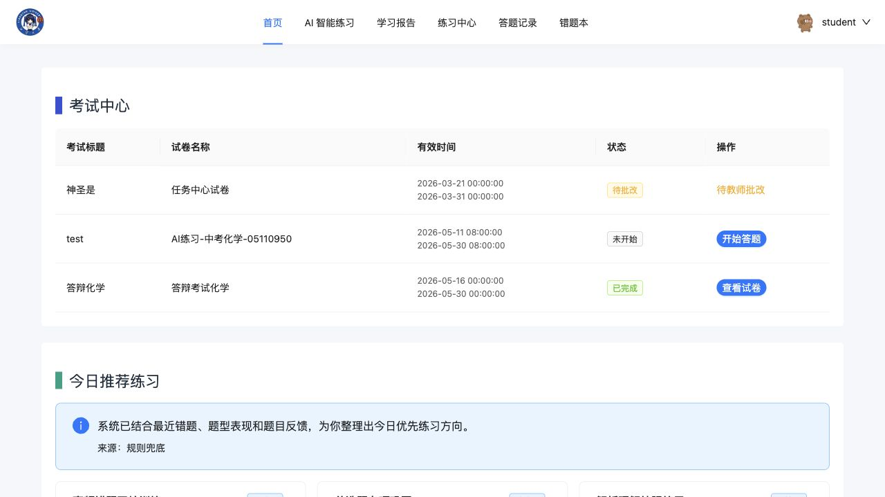
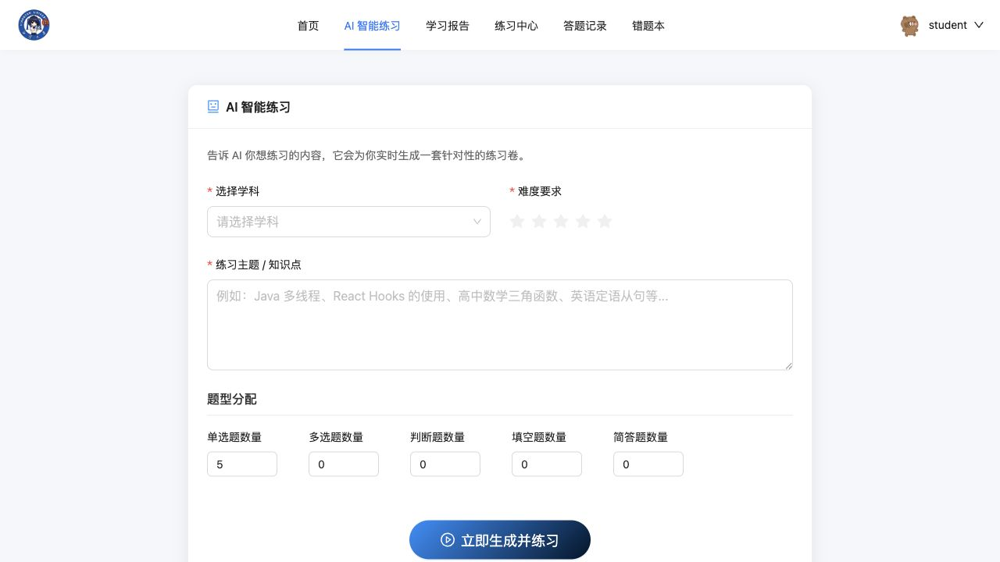
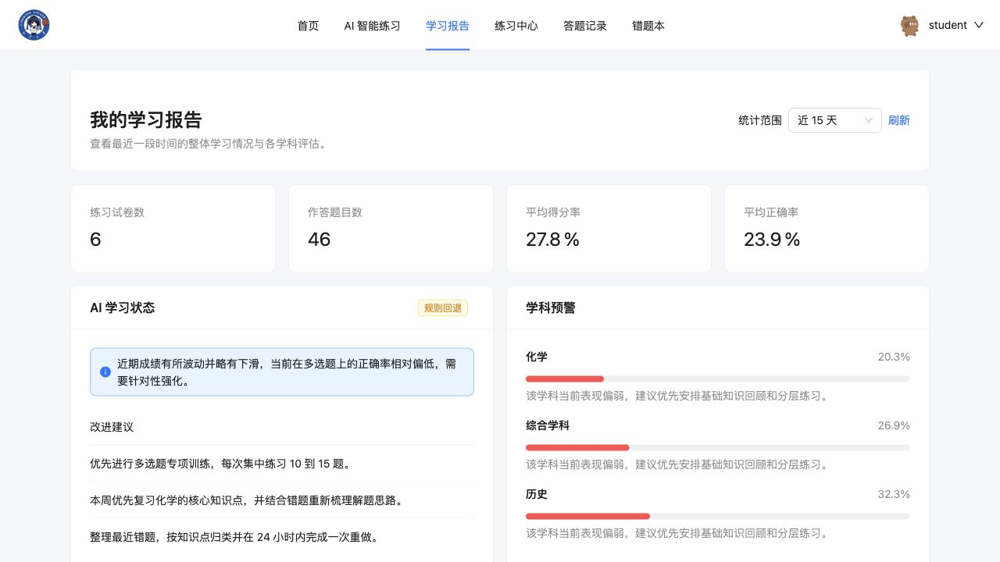
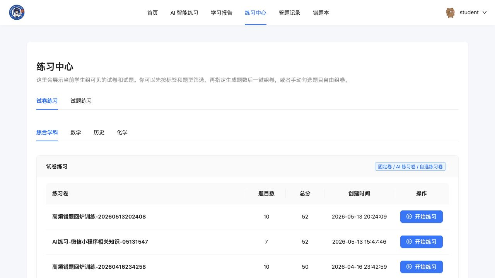
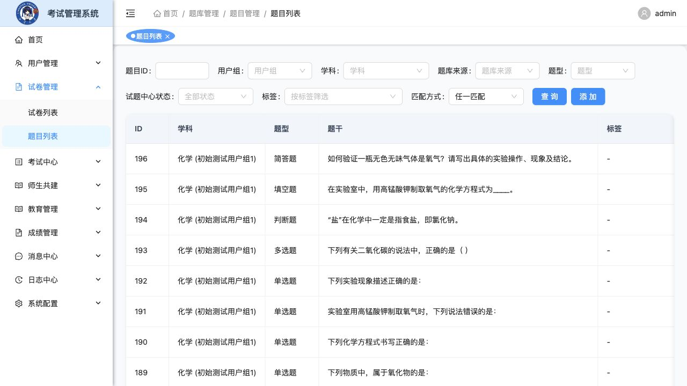
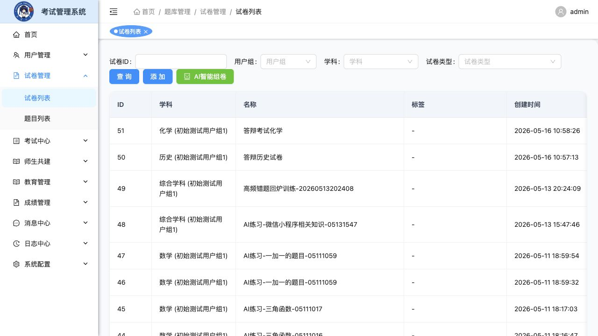
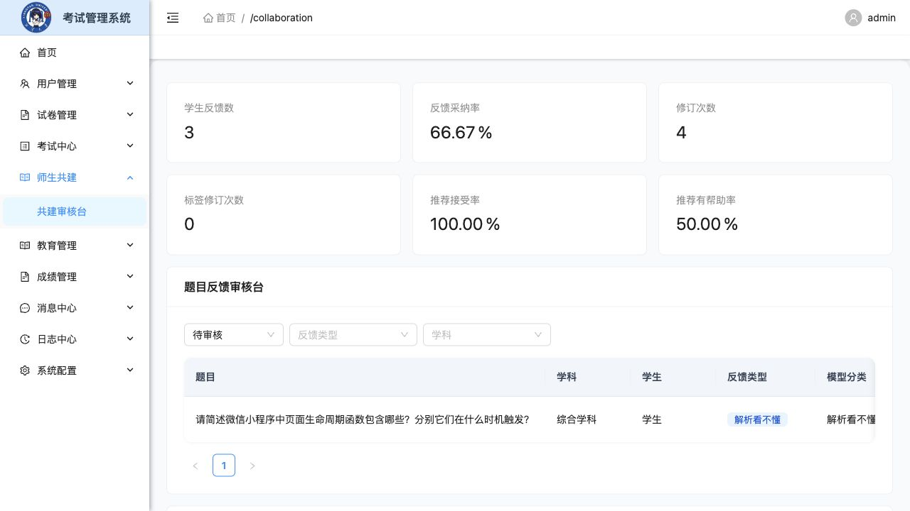
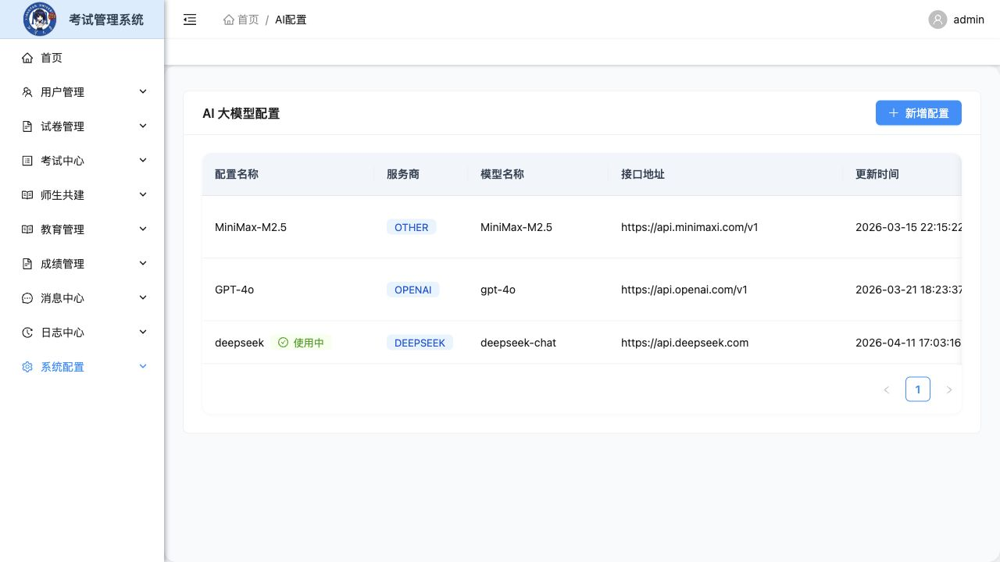
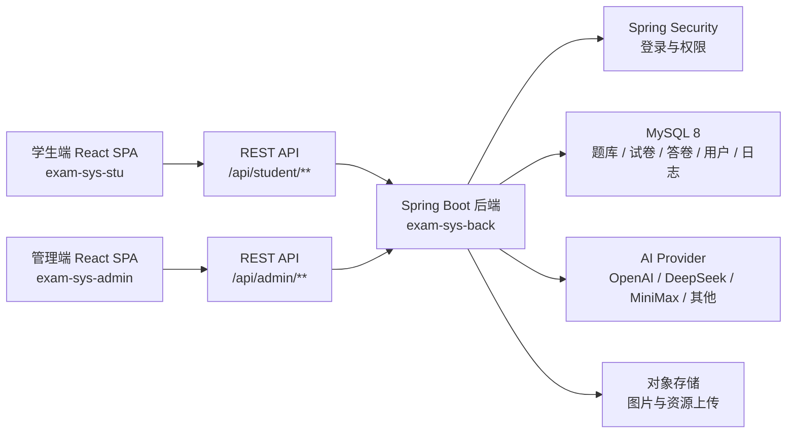

# 在线考试与智能练习平台

一个覆盖「后台出题组卷、学生在线练习、AI 个性化训练、学情分析、师生共建、阅卷统计」的全流程考试系统。项目由管理端、学生端和后端服务三部分组成，既能支撑传统在线考试，也能围绕错题、标签、题型表现和 AI 生成能力形成持续练习闭环。

> 项目完成度较高，不是只展示静态页面的课程 Demo。系统已经包含真实登录鉴权、题库与试卷管理、任务发布、在线答题、答卷回看、AI 组卷、学习报告、协作反馈、消息通知、日志审计和 Docker 化后端部署等完整链路。

## 在线体验

| 入口 | 地址 | 演示账号 |
| --- | --- | --- |
| 学生端 | [https://exam-stu.hakuya.top](https://exam-stu.hakuya.top) | `student` / `123456` |
| 管理端 | [https://exam-admin.hakuya.top](https://exam-admin.hakuya.top) | `test` / `123456` |

公开演示环境中的数据会随着测试操作变化；如果用于正式部署，请及时更换默认账号、数据库密码、上传配置和 AI API Key。

## 系统截图

### 学生端

<table>
  <tr>
    <td width="50%">
      
      <br />
      <b>首页任务与今日推荐</b>
    </td>
    <td width="50%">
      
      <br />
      <b>AI 智能练习生成</b>
    </td>
  </tr>
  <tr>
    <td width="50%">
      
      <br />
      <b>学习报告与薄弱项分析</b>
    </td>
    <td width="50%">
      
      <br />
      <b>练习中心与试卷列表</b>
    </td>
  </tr>
</table>

### 管理端

<table>
  <tr>
    <td width="50%">
      
      <br />
      <b>题库管理与题目统计入口</b>
    </td>
    <td width="50%">
      
      <br />
      <b>试卷管理与 AI 智能组卷</b>
    </td>
  </tr>
  <tr>
    <td width="50%">
      
      <br />
      <b>师生共建审核台</b>
    </td>
    <td width="50%">
      
      <br />
      <b>AI 大模型配置</b>
    </td>
  </tr>
</table>

## 核心能力

### 学生端

- 账号体系：学生注册、登录、退出、个人资料维护和消息中心。
- 首页看板：展示考试任务、练习入口、AI 推荐练习和优秀学员信息。
- 练习中心：支持固定试卷、AI 练习卷、自选题练习，按学科、标签、题型筛选。
- 在线答题：支持开始作答、状态同步、提交答卷、答卷回看和再次编辑。
- AI 智能练习：按学科、难度、知识点、题型数量生成针对性练习卷。
- 学习报告：按时间范围统计练习试卷数、作答题数、得分率、正确率、学科预警和改进建议。
- 错题本与记录：沉淀历史答题记录、错题列表和题目详情，方便复盘。
- 师生共建：学生可提交题目反馈、贡献题解，并接收每日推荐练习方向。
- 考试异常上报：答题过程中可上报异常，为后台审计和处理提供依据。

### 管理端

- 平台总览：查看题库、试卷、答卷、答题统计与学员展示。
- 用户管理：维护学生、管理员账号，支持状态切换、详情查看和用户行为日志。
- 题库管理：覆盖单选、多选、判断、填空、简答题，支持标签、用户组、试题中心可见性、采纳、预览和统计。
- 试卷管理：试卷分页、编辑、预览、统计，并支持 AI 智能组卷。
- 任务管理：创建练习任务或考试任务，绑定试卷和有效时间。
- 阅卷管理：查看答卷列表、读卷详情，支持人工调整判分结果。
- 师生共建审核：审核题目反馈和优秀题解，查看模型分类、分析来源、采纳率和推荐反馈指标。
- AI 配置管理：维护 OpenAI、DeepSeek、MiniMax 等大模型配置，并切换当前启用配置。
- 教育基础数据：维护学科、知识标签、标签题目关系和用户分组。
- 消息与日志：支持站内消息发送、消息分页、用户行为日志和考试异常日志。

### 后端服务

- 基于 Spring Security 的登录、登出、角色鉴权与接口权限控制。
- 管理端、学生端和公共接口分层，业务边界清晰。
- MyBatis Mapper + PageHelper 分页，题库、试卷、答卷、消息、日志等数据表完整落库。
- AI 能力集中在配置与生成服务中，方便切换模型供应商。
- 支持 Docker 构建后端服务，并通过 `docker-compose.yml` 一键拉起 MySQL + 后端。

## 技术栈

| 模块 | 技术 |
| --- | --- |
| 学生端 | React 18、Vite 7、Ant Design 5、React Router 6、Zustand、Axios |
| 管理端 | React 19、Vite 6、Ant Design 6、React Router 7、Redux Toolkit、ECharts、Sass、Axios |
| 后端 | Java 8、Spring Boot 2.1.6、Spring Security、MyBatis、PageHelper、Undertow |
| 数据库 | MySQL 8 |
| 部署 | Docker、Docker Compose、Nginx/静态资源托管 |

## 架构概览



## 目录结构

```text
.
├── exam-sys-admin/          # 管理端，教师/管理员使用
├── exam-sys-stu/            # 学生端，学生练习与考试入口
├── exam-sys-back/           # 后端服务与数据库脚本
│   ├── backup/init.sql      # Docker 初始化数据
│   ├── docs/API.md          # 接口文档
│   └── src/main/resources/  # 配置、Mapper、增量 SQL
├── docs/screenshots/        # README 实机截图
└── docker-compose.yml       # MySQL + 后端服务编排
```

## 快速启动

### 1. 启动数据库与后端

推荐使用 Docker Compose：

```bash
docker compose up -d --build
```

该命令会启动：

- MySQL 8，默认数据库为 `xzs`
- 后端服务，宿主机访问地址为 `http://localhost:8000`
- 初始化 SQL：`exam-sys-back/backup/init.sql`

如果希望本地手动运行后端：

```bash
cd exam-sys-back
./mvnw spring-boot:run
```

本地开发默认读取 `application-dev.yml`，数据库连接为：

```text
jdbc:mysql://localhost:3306/xzs
username: root
password: 123456
```

### 2. 启动管理端

```bash
cd exam-sys-admin
npm install
npm run dev
```

默认地址：`http://localhost:8001`

管理端 Vite 代理会将 `/api` 转发到 `http://localhost:8000`。生产部署时可通过 `.env` 中的 `VITE_API_URL` 指定后端地址。

### 3. 启动学生端

```bash
cd exam-sys-stu
npm install
npm run dev
```

默认地址：`http://localhost:8002`

学生端同样通过 `/api` 代理访问后端。

### 4. 可选环境变量

后端图片上传使用七牛配置，正式部署时通过环境变量注入：

```bash
QINIU_URL=
QINIU_BUCKET=
QINIU_ACCESS_KEY=
QINIU_SECRET_KEY=
```

## 常用命令

| 模块 | 命令 | 说明 |
| --- | --- | --- |
| 后端 | `./mvnw spring-boot:run` | 本地启动 Spring Boot |
| 后端 | `./mvnw clean package` | 打包后端 Jar |
| 后端 | `docker compose up -d --build` | 构建并启动 MySQL + 后端 |
| 管理端 | `npm run dev` | 启动管理端开发服务 |
| 管理端 | `npm run build` | 构建管理端 |
| 学生端 | `npm run dev` | 启动学生端开发服务 |
| 学生端 | `npm run build` | 构建学生端 |

## 接口与权限

接口文档见：[exam-sys-back/docs/API.md](./exam-sys-back/docs/API.md)

主要接口分组：

- `POST /api/user/login`：统一登录
- `POST /api/user/logout`：退出登录
- `/api/admin/**`：管理员/教师接口
- `/api/student/**`：学生端接口
- `/api/common/**`：公共基础数据接口

权限规则：

- 管理端接口需要管理员或教师角色。
- 学生端接口需要学生角色。
- 学生注册接口 `/api/student/user/register` 为公开接口。
- 管理端使用登录态访问；学生端会额外携带 `token` 请求头。

## 数据库脚本

后端数据库相关文件主要位于：

- `exam-sys-back/backup/init.sql`：完整初始化数据，适合 Docker 首次启动。
- `exam-sys-back/backup/exam-system-mysql.sql`：数据库备份。
- `exam-sys-back/src/main/resources/*.sql`：功能模块相关表结构。
- `exam-sys-back/src/main/resources/sql/*.sql`：增量迁移脚本。

如果已有旧数据库，建议先备份，再按增量脚本顺序执行。

## 项目亮点

- 前后台双端完整闭环：不是单独的管理系统或学生页面，而是从题库、组卷、发布、作答、阅卷到复盘的全链路。
- AI 能力落到业务流程：AI 不只是聊天入口，而是参与组卷、专项练习、学情分析、统计解读和推荐练习。
- 题库结构更接近真实教学场景：题型、标签、学科、用户组、试题中心可见性、题目统计和采纳流程都有对应设计。
- 学生学习闭环清晰：练习中心、错题本、学习报告、每日推荐和反馈共建互相连接。
- 管理端具备运营能力：消息、日志、异常上报、审核台、AI 配置和用户管理让系统可维护、可追踪。
- 部署路径明确：后端和 MySQL 可直接通过 Docker Compose 启动，前端作为标准 Vite SPA 构建部署。

## 许可证

项目按 MIT 许可证发布。
